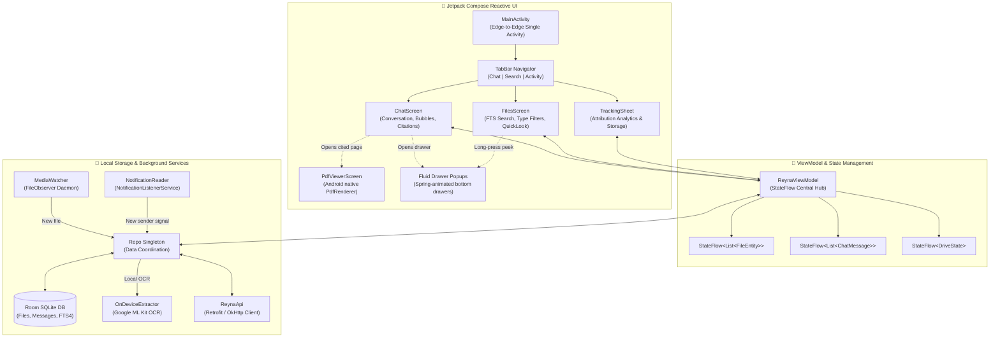
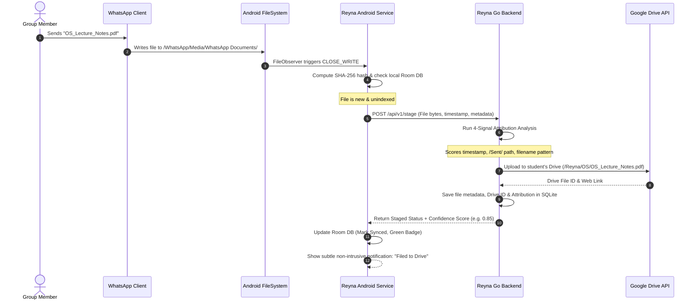
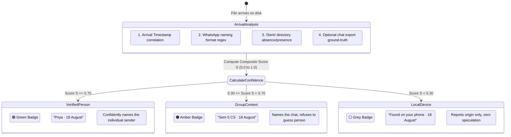
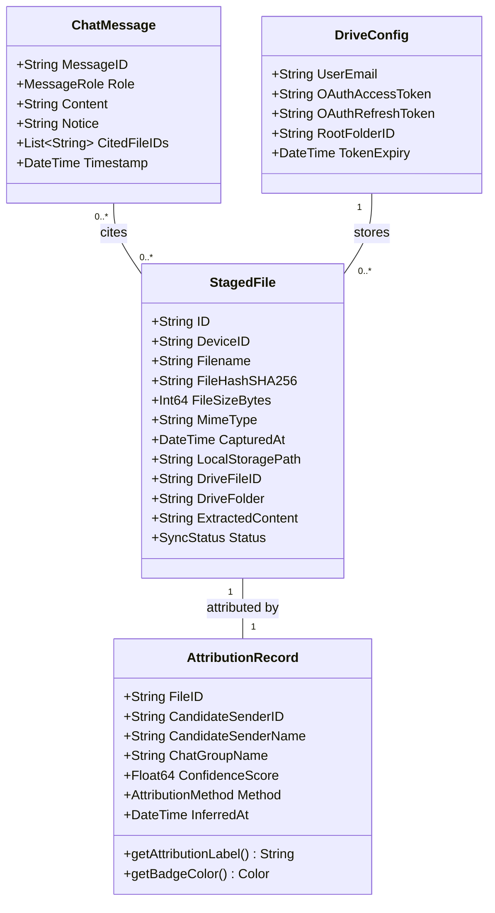

# Reyna — System Architecture & Design Specification

> **"The project file you need is already on your phone."**  
> Reyna is an intelligent, privacy-first document system that turns messy WhatsApp groups into a searchable, self-filing digital library—without requiring a single manual upload or adding bots to group chats.

---

## 1. Executive Summary: What is Reyna in Plain English?

People and teams manage critical affairs—finances, travel, legal agreements, business purchases, and personal records—almost exclusively over **WhatsApp chats**. Invoices, flight/train tickets, contracts, rent agreements, tax receipts, scanned documents, and spreadsheets are constantly shared.

However, within days, those vital documents are buried under thousands of group messages, media, and daily banter. Months later, finding them is painful: scrolling endlessly through media galleries or guessing filenames.

### Why Traditional Systems Fail
Traditional document portals demand manual effort: download the file, open a separate app, choose a folder, add tags, and upload. **Nobody does this consistently.** The friction is too high, so files stay scattered in chat threads.

### The Reyna Breakthrough: Zero-Upload Architecture
Reyna flips this model completely:

1. **No Manual Uploads:** Reyna monitors the storage folder where WhatsApp *already* saves your incoming files on Android (`/Android/media/com.whatsapp/...`).
2. **No Bots in Chats:** No third-party bot joins your groups. Zero phone number bans, zero exposure of private conversations.
3. **Sovereign Google Drive Filing:** Captured files are filed automatically into your **personal Google Drive** (`/Reyna/<Category>/...`). Documents never live on central servers.
4. **Who Shared It (Attribution):** Reconstructs the sender from arrival notifications, `/Sent/` paths, and chat exports with mathematical confidence.
5. **Ask in Plain Language:** Ask naturally in any language, dialect, or tone: *"When is my flight to Mumbai?"*, *"What was the electricity bill amount?"*, or *"Show me the contract Rakesh sent."* Reyna finds the exact document, cites verified quotes and page numbers, and lets you open it with one tap.

---

## 2. Core Architectural Principles

```
┌─────────────────────────────────────────────────────────────────────────────┐
│                            REYNA'S FIVE PILLARS                             │
├───────────────────────┬──────────────────────────┬──────────────────────────┤
│    🔒 Zero Hostage    │      🤖 Zero Bots        │    🎯 Never Guess        │
│ Files go directly to  │ Nothing joins WhatsApp   │ If confidence < 0.70,    │
│ your personal Google  │ chats. Zero risk of bans │ Reyna refuses to name    │
│ Drive. No documents   │ or privacy intrusion.    │ a sender.                │
│ on central servers.   │                          │                          │
├───────────────────────┴──────────────────────────┴──────────────────────────┤
│ 🌐 Universal Language: Zero hardcoded entity tables. LLM handles all        │
│    synonyms, twin cities, and multilingual phrasing.                        │
│ ⚡ Local-First Efficiency: On-device OCR (ML Kit) + Pure Go XML parsers.    │
└─────────────────────────────────────────────────────────────────────────────┘
```

1. **Zero Central Document Storage:** Files live on the user's phone and their own Google Drive.
2. **Zero Bot Vulnerability:** Runs via local Android filesystem monitoring (`FileObserver`).
3. **Strict Attribution Thresholds:** Reconstructing senders requires confidence $\ge 0.70$.
4. **Zero Hardcoded Entities:** Station codes, city aliases, and language keywords are never hardcoded in Go. Handled dynamically via LLM query expansion and vector embeddings.
5. **Extreme Resource Efficiency:** Pure Go parser for Office files (`.docx`, `.pptx`, `.xlsx`). On-device ML Kit OCR for image and PDF scanning.

---

## 3. High-Level UML Architecture Diagram

```mermaid
flowchart TB
    subgraph AndroidClient ["📱 Android Device (Client Side)"]
        direction TB
        WA["WhatsApp App<br/>(Normal Daily Usage)"]
        FS["Android Media Storage<br/>(/Android/media/com.whatsapp/...)"]
        FO["FileObserver Daemon<br/>(Detects CLOSE_WRITE events)"]
        RoomDB[("Local Room SQLite<br/>(Cache, Sync Queue, Chat)")]
        ComposeUI["Jetpack Compose UI<br/>(Chat, Search, Sources, Notices)"]
        SyncMgr["Sync & Upload Engine<br/>(Retrofit / OkHttp)"]

        WA -->|Writes files| FS
        FS -->|Notifies| FO
        FO -->|Stages new file| RoomDB
        RoomDB --> SyncMgr
        ComposeUI <--> RoomDB
        ComposeUI <--> SyncMgr
    end

    subgraph CloudBoundary ["☁️ Secure Network & Cloud Services"]
        Tunnel["Secure Gateway / Tunnel<br/>(ngrok permanent domain / HTTPS)"]
        GDrive["Google Drive API v3<br/>(User's Personal Drive)"]
        GeminiAI["Gemini 2.5 Flash API<br/>(Selective RAG Synthesis)"]
    end

    subgraph GoBackend ["⚙️ Reyna Backend Server (Go + SQLite)"]
        direction TB
        Router["HTTP Router & API Handlers<br/>(/api/v1/stage, /api/v1/ask, etc.)"]
        AttrEngine["Attribution Engine<br/>(4-Signal Confidence Scorer)"]
        DocExtractor["Zero-Cost Doc Extractor<br/>(Pure Go XML/ZIP for Office)"]
        Ranker["Relevance Ranker & NLP<br/>(Whole-word matching, Tokenizer)"]
        ServerDB[("Backend SQLite<br/>(Metadata, Auth, Attribution)")]
        QuotaGate["Quota & Rate Governor<br/>(Fast-fail allowance guard)"]

        Router <--> AttrEngine
        Router <--> DocExtractor
        Router <--> Ranker
        Router <--> QuotaGate
        AttrEngine <--> ServerDB
        Ranker <--> ServerDB
    end

    SyncMgr <==>|Encrypted HTTPS| Tunnel
    Tunnel <==> Router
    Router <==>|Uploads files & organizes| GDrive
    DocExtractor -.->|PDFs only (on-demand)| GeminiAI
    Ranker -.->|Answer synthesis| GeminiAI
```

---

## 4. Component Breakdown & Responsibilities

### 4.1 Android Client Layer (`app.reyna`)

#### Plain English Summary: How the UI Works
The Reyna Android app feels like a quiet, high-performance messaging app rather than a clunky enterprise file manager. You don't browse folders or manage uploads. You simply talk to your archive. 
- **Chat Tab:** You ask questions in plain language ("At what time is my departure to Hyderabad?", "How much was the electric bill?"). Reyna answers directly in text, shows attached document chips with verified sender dots, and provides a `[ 1 source ]` button that opens the exact cited page.
- **Search Tab:** An instant document browser. Supports typing with typos or vague words, filtering by document type (All, Documents, Photos), and previewing any document on long-press (Quick Look).
- **Activity Tab (Tracking):** Shows clear, transparent statistics on how many files were captured, which WhatsApp chats are watched, and how many senders were confidently attributed.

#### Technical Architecture & Reactive State Flow


- **`MainActivity.kt`:** Root single-activity container with `enableEdgeToEdge()`. Listens for WhatsApp chat export share intents via `ACTION_SEND`.
- **`ReynaViewModel.kt`:** Central lifecycle-aware ViewModel exposing immutable `StateFlow` streams (`files`, `messages`, `stage`, `driveState`, `choice`). Dispatches background queries to `Repo` on `Dispatchers.IO`.
- **`ChatScreen.kt`:** 
  - Reactive message list with Signal-style corner-tail message bubbles (`Bubble`).
  - Found file chips with attribution confidence dots (`ConfidenceDot`: Green $\ge 0.70$, Amber $\ge 0.30$, Gray $< 0.30$).
  - `[ X sources ]` button opens spring-animated `SourcesSheet` displaying exact quotes, surrounding context, page number, and "Open" action.
  - Interactive disambiguation sheet (`ChoiceSheet`) when a query requires document selection.
  - Animated mascot signature (`ReynaMascotAnimated`, cycling 5 frames) displaying live backend progress ("Reading document...").
- **`FilesScreen.kt`:** 
  - 120ms debounced SQLite FTS full-text search + Levenshtein fuzzy matching (`FuzzySearch.kt`).
  - Filter chips (`All`, `Documents`, `Photos`) and chat facets.
  - Long-press triggers macOS Quick Look peek preview (`QuickLookModal.kt`).
- **`PdfViewerScreen.kt`:** Native in-app PDF rendering via Android's `PdfRenderer` (API 21+). Clamps and jumps directly to cited page with top monospace quote bar.
- **`components/DrawerPopups.kt`:** High-performance spring-animated bottom drawers (`FluidBottomDrawer`, damping 0.82, stiffness 400) and top notification pills (`FluidTopNotification`).
- **`ocr/OnDeviceExtractor.kt`:** Local OCR using Google Play Services ML Kit Vision Text Recognition + Android `PdfRenderer`. Runs on-device without network latency.

### 4.2 Go Backend Engine (`cmd/server`, `internal/`)

#### Zero-Hardcoding Hybrid Retrieval Engine
- **Unicode UAX #29 Tokenizer (`internal/repository/store.go`):** Replaces ASCII filters with `unicode.IsLetter` and `unicode.IsDigit`, preserving Hindi (Devanagari), Tamil, Telugu, and Arabic scripts.
- **Full Credit Body Relevance (`internal/relevance/relevance.go`):** `Scored()` gives full `credit += 1.0` for body text matches, stopping `Floor()` from discarding numeric WhatsApp files (`4656526133.pdf`).
- **First-Class Hybrid Search:** Combines SQL broad recall with pre-computed 768-dim Gemini vector cosine similarities.
- **Dynamic LLM Query Expansion (`internal/nlp/classifier.go`):** Gemini translates queries, auto-corrects typos (`"hyderbad"` $\to$ `"Hyderabad"`), resolves station aliases (`"Hyderabad"` $\to$ `"Secunderabad"`), and emits structured `search_terms`.
- **Direct Factual QA:** Factual queries bypass ambiguity choice sheets. Top candidates are passed directly to Gemini for relation, time, and route resolution.
- **Structured Self-RAG Output:** Gemini emits a clean JSON contract with `"found": true/false`, eliminating fragile string-matching heuristics.
- **Zero-Cost Office Parser (`internal/docs`):** Pure Go stdlib XML/ZIP parser for `.docx`, `.pptx`, `.xlsx` with zero API charges.

---

## 5. Key Workflows (UML Sequence Diagrams)

### 5.1 File Ingestion & Attribution Sequence



---

### 5.2 Conversational Question & Retrieval Sequence

```mermaid
sequenceDiagram
    autonumber
    actor User as User
    participant UI as Android Client (ChatScreen)
    participant Srv as Go Backend (/api/nlp/retrieve)
    participant AI as Gemini 2.5 Flash
    participant DB as SQLite DB (Store)

    User->>UI: Types: "at what time is my departure to Hyderabad" (or "bijli ka bil kitna aaya")
    UI->>Srv: POST /api/nlp/retrieve (Query: "...", History: [...])
    Srv->>Srv: Smalltalk Check (English + Indic Native & Romanized)
    Note over Srv: Not smalltalk; Proceed to NLP Analysis
    Srv->>AI: ParseNLPQueryDetailed (Query + History)
    AI-->>Srv: ParsedNLPQuery { who, what, why: "qa", search_terms: ["departure", "Hyderabad", "Secunderabad"], cues: true }
    Srv->>DB: SearchFilesNLPScored with Unicode Tokenizer & search_terms
    DB-->>Srv: Candidate files (matches across filename, AI summary, and body text)
    Srv->>Srv: Relevance Ranker (AI content summary weighting & core entity prioritization)
    Srv->>AI: Compute 768-dim query embedding (full conversational query)
    AI-->>Srv: 768-dim float vector
    Srv->>DB: GetAllEmbeddings & compute Cosine Similarities
    Srv->>Srv: Hybrid Rerank: Boost lexical matches with semantic similarity (+sim * 60.0; retrieve dense matches sim >= 0.48)
    Note over Srv: isFactualQuestion == true: Skip Ambiguity Sheet!
    Srv->>AI: GenerateRetrievalReply (Query, Top Candidates Context)
    AI-->>Srv: JSON { found: true, answer: "...", quotes: [...] }
    Srv->>Srv: Verify citations against stored file text
    Srv-->>UI: Return JSON { status: "answered", reply: "...", citations: [...], files: [...] }
    UI->>UI: Render natural reply bubble + source citations + chips
```

---

## 6. The Attribution Engine: How Reyna Knows Who Shared It

A raw file sitting in Android storage has no author tag. It is just bytes on disk. Reyna solves this by acting as a digital forensic investigator combining **four independent signals**:



### The Iron Rule of Attribution
> **"A wrong name is infinitely worse than no name."**  
If attribution confidence falls below `0.70`, the system will **never** display a person's name. It will downgrade gracefully to chat-level or device-level origin.

---

## 7. Data Models & Schema Design (UML Class Diagram)



---

## 8. Technology Stack Summary

| Layer | Technologies Used | Key Reason for Selection |
| :--- | :--- | :--- |
| **Android Client** | Kotlin, Jetpack Compose, Room DB, Android `FileObserver` | Zero-battery-drain filesystem hooks, native performance, modern reactive UI. |
| **Backend Server** | Go (Golang 1.22+), SQLite (`mattn/go-sqlite3`), `golang-jwt` | Single standalone binary, sub-millisecond execution, only 2 external dependencies. |
| **Local Document Parsing** | Go `archive/zip` & `encoding/xml` | Reads `.docx`, `.pptx`, `.xlsx` natively with 0ms latency and zero LLM cost. |
| **AI / Retrieval** | Gemini 2.5 Flash, Whole-Word Ranked BM25-style scoring | Cost-efficient RAG, multi-lingual question answering, strict context enforcement. |
| **Cloud Storage** | Google Drive API v3 | Keeps data in student's own ownership; zero centralized hosting liabilities. |
| **Networking** | ngrok reserved domain / cloudflared tunnels | Permanent webhook and OAuth callback URLs without manual DNS reconfiguration. |

---

## 9. Security, Privacy & Ethics

1. **No Group Spying:** Reyna never parses user chat messages in groups. It inspects only documents downloaded to disk.
2. **User Data Sovereignty:** Files travel directly between the user's phone and their personal Google Drive. 
3. **Transparent Notices:** If the system is out of API allowance, it displays a polite amber notice with the exact time of quota replenishment, rather than failing silently or inventing answers.
4. **Resilient to Platform Updates:** Because Reyna interfaces with Android's scoped media storage rather than scraping WhatsApp's private memory or hooking WhatsApp's app binary, it is fully compliant with Android security sandboxing.

---

## 10. Operational Playbook & Invariants (For Future AI & Developers)

> **CRITICAL CONTEXT FOR AI ASSISTANTS:**  
> This section documents the operational environment, active codebases, and hard-won engineering invariants. Adhering to these rules guarantees that future coding sessions will not regress previous bug fixes.

### 10.1 Workspace Disambiguation
* **Active Repository:** `/Users/harsh/code/reyna-app`  
  This contains the active Android client (`android/app/...`), Go backend server (`cmd/`, `internal/`), and `justfile`.
* **Legacy Repository:** `/Users/harsh/code/reyna`  
  This was the initial v0.1 prototype (Baileys bot + React dashboard). The Baileys WhatsApp bot and web frontend are obsolete. Always verify you are editing in `/Users/harsh/code/reyna-app` for active application code.

### 10.2 Environment & Build Commands

| Task | Command (`justfile` in `reyna-app`) | Description |
| :--- | :--- | :--- |
| **Run Backend** | `just backend-bg` | Builds and starts server on `:8080` detached with `nohup`. Uses `-sTCP:LISTEN` so tunnels are not killed. |
| **Start Tunnel** | `just tunnel-up` | Starts permanent ngrok domain (`superformally-reckonable-etha.ngrok-free.dev`). |
| **Build Debug APK** | `just build` | Assembles debug Android APK. |
| **Build Release APK** | `just apk-release` | Builds signed production APK to `~/Desktop/reyna.apk` and `Reyna_APKs/`. |
| **Run Linter & Tests** | `just check` | Runs `go vet` and all package tests. |
| **Device Logs** | `just logs` | Streams Android logcat filtered for `app.reyna`. |

#### Android Emulator (AVD) Configuration
* **SDK Location:** `/opt/homebrew/share/android-commandlinetools` (`sdk.dir` in `local.properties`).
* **AVD Name:** `reyna_pixel` (arm64, Android API 35).
* **Headless Launch:**
  ```bash
  export ANDROID_HOME=/opt/homebrew/share/android-commandlinetools
  export PATH=$ANDROID_HOME/platform-tools:$ANDROID_HOME/emulator:$PATH
  emulator -avd reyna_pixel -no-snapshot-load -gpu swiftshader_indirect &
  ```
* **Switching Targets:**
  * Emulator: `just point-at-emulator` then `just build`.
  * Release / Device: `just point-at <tunnel url>` before building release.

### 10.3 The Fourteen Invariants (Never Regress These)

1. **Strict 0.70 Attribution Floor:** A file on disk carries no author. Reyna reconstructs senders from 4 signals. If confidence is below `0.70`, **never name a person**. Downgrade to chat name or "Found on your phone". A wrong name destroys user trust.
2. **Whole-Word Matching Only:** Filename and token matching in `internal/relevance` and `android/.../data/Words.kt` must match on **whole words**, splitting on non-alphanumeric and letter/digit boundaries. Substring matching (e.g. "ode" matching "diode" or "1" matching "part1") is forbidden.
3. **Device Identity Isolation:** Files uploaded from Android carry the internal identity `device`. The device identity must **never** be attributed as a human sender.
4. **Zero API Cost for Office Files:** `.docx`, `.pptx`, and `.xlsx` files are parsed locally using Go's built-in `archive/zip` and `encoding/xml` in `internal/docs`. Only PDFs cost a model call.
5. **Fast-Fail Quota Wall (0.03s):** Gemini free tier permits 20 calls/day/model (configured in `GEMINI_MODEL`). When quota is exhausted, `Classifier.OutOfAllowanceUntil` immediately returns an amber `Notice` naming the reset time (Pacific midnight, ~12:30 IST). Never wait for rate-gate timeouts.
6. **Notices are Cards, Not Prose:** Allowance limits or system notices must be returned in the `Notice` response field and rendered as amber cards. Never synthesize a fake directory listing as assistant text.
7. **Explicit Room Database Migrations:** Any schema update in Android's Room DB must have an explicit migration (e.g. `MIGRATION_2_3` in `Db.kt`). Never rely solely on `fallbackToDestructiveMigration`, as that drops the student's entire local document library.
8. **Distinguish `ErrNotAttempted` from `UnreadableSentinel`:** If a document read fails due to quota or network, return `ErrNotAttempted`. Only write `UnreadableSentinel` if the file was genuinely parsed and found to have no text. Otherwise, quota exhaustion permanently bricks documents.
9. **Non-Destructive Phrase Stripping:** Stop-word removal in `internal/nlp/strip.go` must match whole phrases longest-first, never using naive string replacement which turns "meant" into "ant" or "theory" into "ory".
10. **Smalltalk Precedes Retrieval:** `nlp.IsSmallTalk` must be evaluated **before** document search and before ambiguity branching so that messages like "thanks" or "hi" never consume document search quota.
11. **Zero Hardcoded Entity Dictionaries:** Never hardcode city names, station codes, railway junctions, or academic acronyms in Go code. LLM query expansion and vector embeddings handle all domain entities and typos dynamically.
12. **Direct Factual QA Routing:** Questions seeking factual answers or relations (e.g. departure time, bill total) must never trigger false ambiguity choice sheets. Candidate context is passed directly to the LLM for relation verification and answer synthesis.
13. **Strict Temporal Calendar Grounding:** Prompts that synthesize answers across documents must provide the exact current real-world timestamp and calendar anchor (Today, Tomorrow, Yesterday in IST). LLMs must NEVER assume upcoming event dates (e.g. flights a month away) correspond to "tomorrow" or "today" relative to the user's question. If no event matches the relative date, Reyna explicitly states that nothing is scheduled for that date before mentioning upcoming events with their real calendar dates.
14. **Identity & Passenger Grounding:** WhatsApp chats aggregate documents shared across family, friends, and group members. Reyna must NEVER assert "You are traveling" or "Your flight/bill" unless the passenger or recipient name explicitly matches the confirmed user identity. If the identity is unconfirmed or names other individuals, Reyna must verbatim name the passengers/recipients found in the document.
